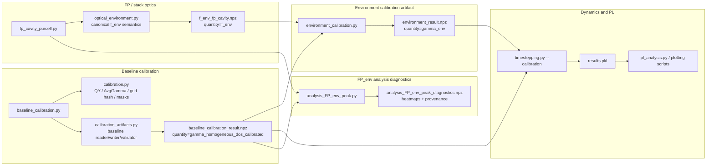
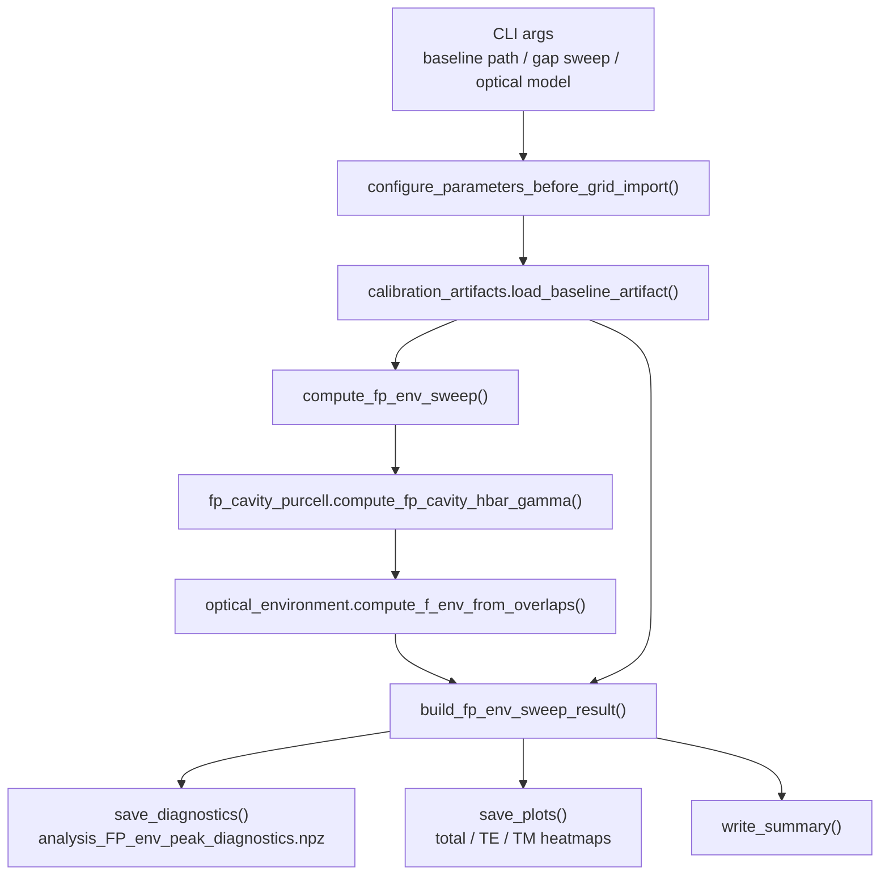
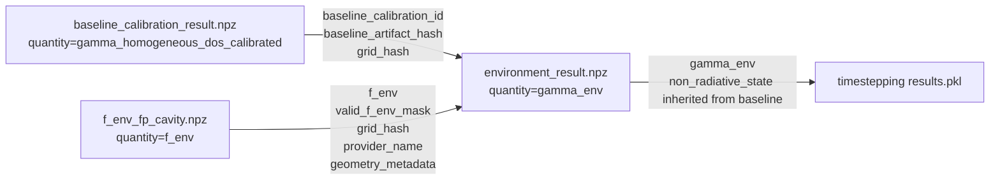

# FP 环境修正、校准 artifact 与动力学/PL 工作流说明

生成时间：2026-06-09 20:42:09 CEST

本文整理 `analysis_FP_env_peak.py`、FP/stack optics、calibration artifact、`timestepping.py` 与后续 PL 分析之间的关系。重点区分两条相近但用途不同的路径：

- **诊断/探索路径**：`analysis_FP_env_peak.py` 读取 baseline artifact，现场扫描 FP spacer，直接生成 `gamma_env` 热图与 diagnostics。
- **动力学生产路径**：optical provider 先写出 canonical `f_env` artifact，`environment_calibration.py` 再把它与 baseline artifact 合并成 `environment_result.npz`，供 `timestepping.py --calibration` 使用。

## 总体导图



## 关键概念

### Baseline artifact

Baseline artifact 是 without-stack homogeneous monolayer 的自洽校准结果。它的核心机器量是 $\gamma_{\mathrm{homogeneous\_DOS\_calibrated}}(K)$，同时保存 radiative scale、non-radiative state、target/achieved QY、target/achieved AvgGamma、grid hash 与 artifact hash。

$$
\gamma_{\mathrm{homogeneous\_DOS\_calibrated}}(K)
=
s_{\mathrm{rad}}\,
\gamma_{\mathrm{homogeneous\_DOS\_raw}}(K)
$$

代码对应：`calibration_artifacts.py` 中 `write_baseline_artifact()` 直接实现该乘法，变量 `gamma_rad_scale` 对应 $s_{\mathrm{rad}}$，`gamma_homogeneous_dos_raw` 对应 $\gamma_{\mathrm{homogeneous\_DOS\_raw}}(K)$，输出字段为 `gamma_homogeneous_dos_calibrated`。

Baseline artifact 的上游是 `baseline_calibration.py`。它用 `calibration.py` 的 `time_integrated_qy()`、`population_weighted_average_gamma()`、`make_collection_mask()`、`hash_grid_payload()` 等 helper 完成校准目标与一致性检查。

### Optical `f_env` artifact

`f_env` 是 structured optical environment 相对于 homogeneous reference 的无量纲增强因子。它不是已经校准好的 radiative rate，也不应被当作 legacy gamma 使用。

$$
f_{\mathrm{env}}(K)
=
\frac{O_{\mathrm{env}}(K)}
{O_{\mathrm{hom}}(K)}
$$

代码对应：`optical_environment.py` 中 `compute_f_env_from_overlaps()` 直接实现该 ratio。`overlap_env` 对应 $O_{\mathrm{env}}(K)$，`overlap_homogeneous_reference` 对应 $O_{\mathrm{hom}}(K)$，函数同时输出 `valid_f_env_mask`。`fp_cavity_purcell.py` 中 `compute_fp_cavity_hbar_gamma()` 调用该函数，并把结果保存为 `F_stack_ratio` / `f_env`。

`valid_f_env_mask` 的语义很重要：不可辐射区可以是合法的 physical zero；可辐射区若 homogeneous denominator 不可靠，则标记为 invalid。正式 dynamics 默认不应吞掉 invalid radiative bins。

### Environment artifact

Environment artifact 把 optical `f_env` 与 authoritative baseline 组合成动力学可直接使用的 $\gamma_{\mathrm{env}}(K)$。

$$
\gamma_{\mathrm{env}}(K)
=
f_{\mathrm{env}}(K)\,
\gamma_{\mathrm{homogeneous\_DOS\_calibrated}}(K)
$$

代码对应：`environment_calibration.py` 中 `run_environment_calibration()` 直接实现该乘法，`f_env_artifact.f_env` 对应 $f_{\mathrm{env}}(K)$，`baseline.gamma_homogeneous_dos_calibrated` 对应 $\gamma_{\mathrm{homogeneous\_DOS\_calibrated}}(K)$，输出字段为 `gamma_env`。`analysis_FP_env_peak.py` 中 `build_fp_env_sweep_result()` 对 spacer sweep 矩阵实现同一个公式。

`environment_calibration.py` 的价值不只是乘法。它还负责：

- 校验 `f_env` artifact 的 `quantity="f_env"`，避免 legacy gamma 被当成 ratio 再乘一次。
- 校验 baseline artifact 的 `baseline_artifact_hash`。
- 校验 baseline 与 `f_env` 共享同一个 `grid_hash`。
- 保存 `provider_name`、`radiative_momentum_reference`、`geometry_metadata_json` 和 `baseline_snapshot_json`。
- 明确记录该 artifact 的 `quantity="gamma_env"`。

## 两条工作流的关系

### 1. `analysis_FP_env_peak.py`：探索/诊断路径

`analysis_FP_env_peak.py` 的定位是“用 baseline calibration 口径画 FP spacer sweep 的真实 dynamics 输入量”。它不调用 `environment_calibration.py`，而是直接读 baseline artifact，再现场调用 FP provider 生成每个 gap 的 `f_env`。



对每个 spacer gap，脚本保存三类矩阵：

- `f_env_matrix`、`f_env_te_matrix`、`f_env_tm_matrix`：FP provider 生成的 ratio。
- `gamma_env_total_matrix`、`gamma_env_te_matrix`、`gamma_env_tm_matrix`：用于图和解释的 calibrated observable。
- `legacy_hbar_gamma_dos_weighted_matrix`：旧 thermal-scaled FP gamma，仅作为 diagnostics，不是 canonical output。

代码对应：`analysis_FP_env_peak.py` 中 `build_fp_env_sweep_result()` 读取 `baseline.gamma_homogeneous_dos_calibrated`，再对 `f_total`、`f_te`、`f_tm` 分别做逐点乘法；`save_diagnostics()` 把这些矩阵和 baseline provenance 一起写入 `.npz`。

### 2. `environment_calibration.py`：动力学 production artifact 路径

`environment_calibration.py` 面向后续动力学，入口是一个 JSON config。已有配置文件位于 `calibration_configs/generated/`，典型字段包括：

```json
{
  "baseline_calibration_path": "calibration_runs/baseline_real_homogeneous_dos_manual_500T3",
  "baseline_artifact_hash": "...",
  "f_env_artifact_path": "photon_pickles/fp_gap250_exact_semi_infinite_ag/f_env_fp_cavity.npz",
  "run_id": "fp_gap250_exact_semi_infinite_ag"
}
```

该路径要求 `f_env` 先由 optical provider 保存成 artifact。对 FP provider 来说，保存入口是 `fp_cavity_purcell.py` 的 `save_result()`，其中调用 `optical_environment.write_f_env_artifact()` 写出 `f_env_fp_cavity.npz`。

`environment_calibration.py` 产出目录通常是 `calibration_runs/environment_<run-id>/`，核心文件是：

- `environment_result.npz`
- `environment_config.json`
- `summary.md`

`environment_result.npz` 是给动力学使用的主 artifact。

### 3. `timestepping.py`：动力学消费路径

`timestepping.py` 的正式入口是：

```bash
python timestepping.py --calibration PATH
```

如果 `PATH` 指向 baseline artifact，`timestepping.py` 加载 $\gamma_{\mathrm{homogeneous\_DOS\_calibrated}}(K)$ 并标记 `calibration_stage="baseline"`。如果 `PATH` 指向 environment artifact，`timestepping.py` 加载 $\gamma_{\mathrm{env}}(K)$ 并标记 `calibration_stage="environment"`。

代码对应：`timestepping.py` 中 `load_calibration_artifact()` 根据 artifact 的 `quantity` 分派；`_load_environment_for_timestepping()` 要求 `quantity="gamma_env"`，读取 `gamma_env`，校验 `grid_hash`、shape、非负性、baseline path 和 `baseline_artifact_hash`，再从 referenced baseline 继承 `non_radiative_state`。

动力学后续输出进入 `results.pkl`，PL / lifetime / distribution 分析通常读取 dynamics 结果，而不是直接读取 `environment_result.npz`。因此 `PL analysis` 看到的是 $\gamma_{\mathrm{env}}(K)$ 影响后的 population dynamics。

## 节点职责表

| 节点 | 主要职责 | 输入 | 输出 | 是否生产 authoritative artifact |
|---|---|---|---|---|
| `calibration.py` | 纯 helper：QY、AvgGamma、mask、grid/hash 校验 | arrays / grid metadata | 数值结果或校验结果 | 否 |
| `baseline_calibration.py` | 运行 without-stack baseline calibration | config、raw homogeneous gamma | baseline run directory | 是 |
| `calibration_artifacts.py` | baseline artifact IO、validation、hash、snapshot | baseline result path | `BaselineArtifact` | 是，负责 baseline 语义 |
| `optical_environment.py` | 定义和保存 canonical `f_env` | optical overlaps、grid metadata | `f_env`、`valid_f_env_mask`、`f_env.npz` | 是，负责 optical ratio artifact |
| `fp_cavity_purcell.py` | FP current-sheet provider | K grid、energy、geometry、material model | `FPCavityResult`、`f_env_fp_cavity.npz` | 间接产出 `f_env` artifact |
| `environment_calibration.py` | 合并 baseline 与 `f_env`，生成 dynamics-ready `gamma_env` | baseline artifact、`f_env` artifact | `environment_result.npz` | 是 |
| `analysis_FP_env_peak.py` | 诊断 spacer sweep，画 calibrated FP_env heatmap | baseline artifact、gap sweep、FP model | diagnostics `.npz`、heatmaps、summary | 否，偏诊断 |
| `timestepping.py` | 加载 calibration artifact 并跑 EOM dynamics | baseline/environment artifact | `results.pkl` | 否，产出 simulation result |
| `pl_analysis.py` / plotting | 从 dynamics 结果提取 PL/lifetime/distribution | `results.pkl` | figures / analysis tables | 否 |

## Artifact 之间的依赖和防错边界



关键防错点：

1. **防 double scaling**：`legacy_gamma` 或 `hbar_gamma_dos_weighted` 不能作为 `f_env` 输入再乘 baseline。
2. **防 grid mismatch**：baseline、`f_env`、environment、dynamics 必须共享同一套 `k`、`kvec`、`Abin`、`Nk`、`k_end`。
3. **防 baseline 漂移**：environment artifact 保存 `baseline_artifact_hash`，`timestepping.py` 加载时会重新 hash referenced baseline 并比较。
4. **防 invalid optical ratio**：`valid_f_env_mask` 区分 physical zero 和 invalid denominator。
5. **防误标自洽**：`--gamma-file` 和 `--use-sc-gamma` 是 legacy / partial calibration，不能和 `--calibration` 同时作为主输入，也不能标记为 self-consistent。

## 推荐阅读顺序

1. 先读 `calibration.py`，理解 grid、QY、AvgGamma、hash 的统一定义。
2. 再读 `calibration_artifacts.py`，理解 baseline artifact 的字段和 production load policy。
3. 读 `optical_environment.py`，理解 `f_env` 是 ratio，不是 gamma。
4. 读 `environment_calibration.py`，理解正式 `gamma_env` artifact 的生成。
5. 读 `timestepping.py` 中 `load_calibration_artifact()` 相关函数，理解 dynamics 如何消费 artifact。
6. 最后读 `analysis_FP_env_peak.py`，把它看成同一公式下的 FP spacer sweep 诊断入口。

## 简短结论

`environment_calibration.py` 主要是为了动力学准备 production-grade calibration artifact：它把 FP/stack optics 产出的 canonical `f_env` 与 baseline calibration 产出的 homogeneous calibrated gamma 合成 `gamma_env`，并附带严格 provenance 与 grid/hash 校验。`analysis_FP_env_peak.py` 则是同一物理口径的可视化诊断工具，用来探索不同 FP spacer geometry 对 $\gamma_{\mathrm{env}}(K)$ 的影响。
